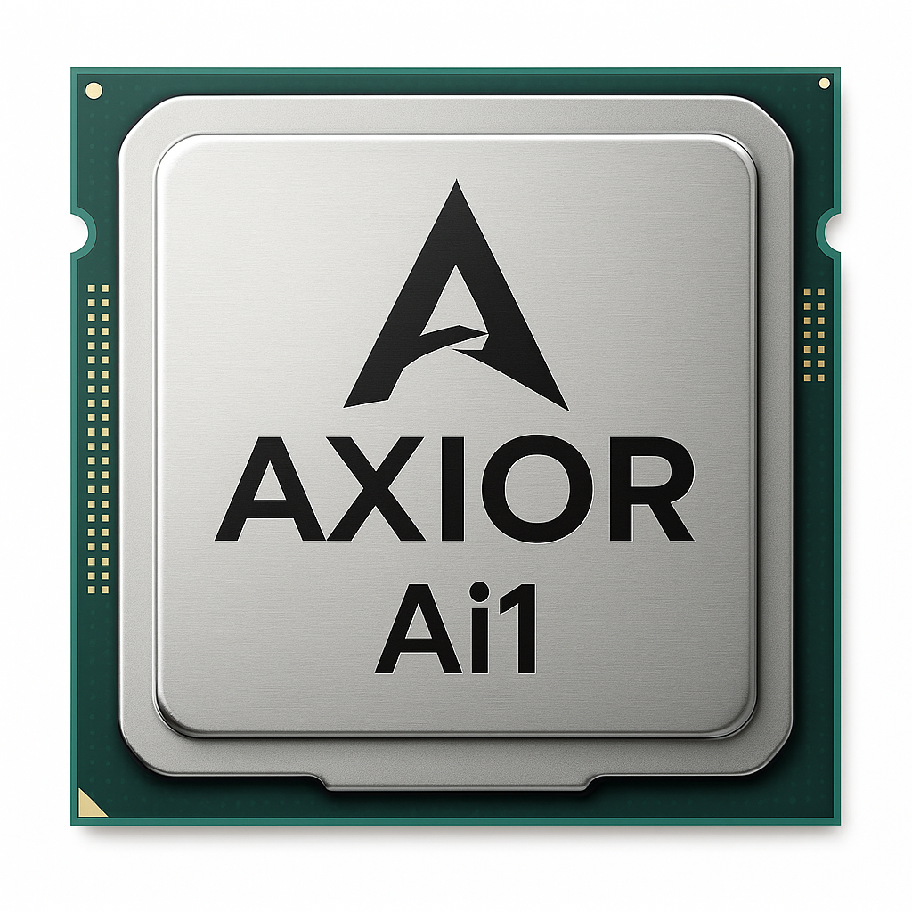
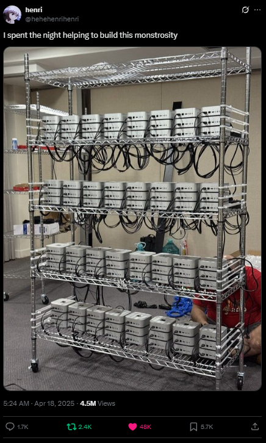
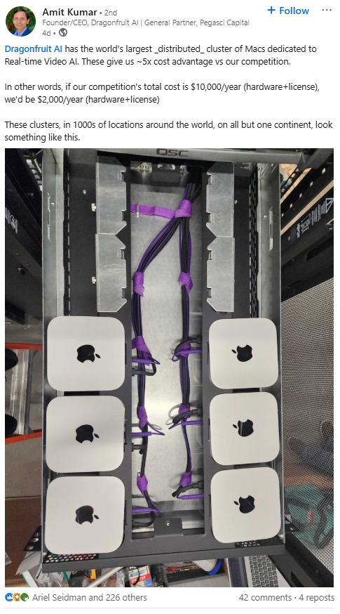
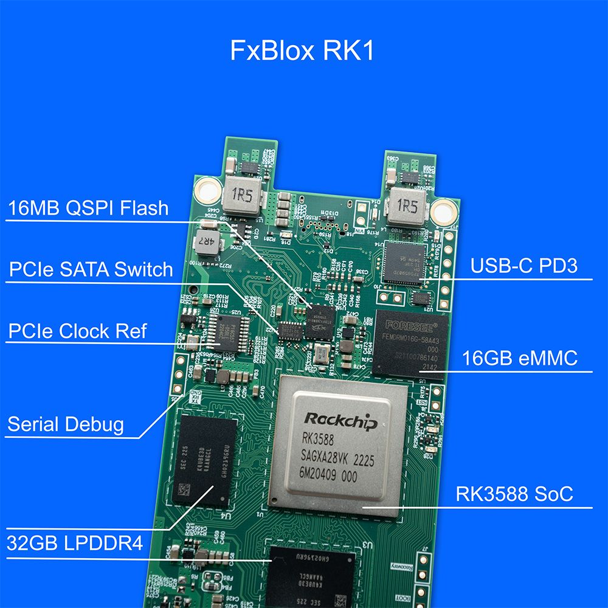

# Axior: The DeepSeek Moment for AI Hardware

Axior is a chipmaker on a mission to shatter the monopoly of San Francisco AI inference giants. We are creating a “DeepSeek moment” for the hardware layer. We achieve this by delivering open, modular, and accessible AI chips and modules that empower developers, researchers, and businesses to build, scale, and own their AI inference infrastructure, without vendor lock-in.

Just as DeepSeek and Llama have democratized access to powerful AI models, Axior is commoditizing the silicon that runs them. Our platform is designed for the new wave of local and edge AI, where privacy, cost, and flexibility matter most.

> **Why Inference?**
> AI innovation is bottlenecked by closed, cloud-centric hardware. Local inference enables privacy, low-latency, and cost-effective deployment. This empowers everyone from researchers to SMBs to run state-of-the-art models on-premises.
>
> While AI training remains a crucial part of model development, it is still largely confined to massive data centers due to its immense computational and power requirements. Companies like Tenstorrent and others are actively working to challenge NVIDIA's CUDA-based grip on the training ecosystem, but the training market is already well-served by existing infrastructure and ongoing innovation. Inference, on the other hand, is critically underserved. For any real degree of agency and control, AI inference must move to the user and the edge. This shift unleashes a new wave of innovation and competitive betterment of user experience, by empowering a subset of otherwise consumers to become infrastructure providers.

## Why Now? The Rise of Local AI Clusters

- Mac Mini clusters are already being used for local AI inference ([heise.de](https://www.heise.de/en/news/Local-AI-Nemotron-70B-on-four-Mac-minis-M4-Pro-with-Thunderbolt-5-interconnect-10015283.html), [Geeky Gadgets](https://www.geeky-gadgets.com/exploring-the-potential-of-m4-mac-mini-clusters-for-machine-learning/)), but they are closed, expensive, and not modular.
- Unified memory and efficient SoCs have enabled new distributed AI setups, but these solutions are expensive, closed, and not modular.
- The edge AI hardware market is projected to more than double by 2029 ([MarketsandMarkets](https://www.marketsandmarkets.com/Market-Reports/edge-ai-hardware-market-158498281.html)), with demand for local, private, and scalable inference solutions.
- No direct competitor offers open, modular, Jetson-compatible SoMs with unified DDR5 memory and clustering support.

<table>
  <tr>
    <td align="center">
      <a href="https://x.com/WilmsRolf/status/1913237853267505351">
         
        Tweet by @WilmsRolf
      </a>
    </td>
    <td align="center">
      <a href="https://x.com/hehehenrihenri/status/1913161609507205549">
         
        Tweet by @hehehenrihenri
      </a>
    </td>
    <td align="center">
      <a href="https://www.linkedin.com/posts/amitkumar_dragonfruit-ai-has-the-worlds-largest-distributed-activity-7319051507281063937-wfAQ/">
         
        LinkedIn post by Amit Kumar
      </a>
    </td>
  </tr>
</table>

> Today’s innovators are forced to build expensive, closed Mac Mini clusters for local AI. Axior unlocks this capability for everyone: open, modular, and affordable.

## Mission
Axior is building the **“Raspberry Pi of AI”**, the foundation for the next generation of open, accessible, and scalable AI hardware, to power the new wave of local AI innovation. Our platform is designed for:
- **DIY AI enthusiasts** building local clusters
- **Consumer devices** (smart devices, robots, kiosks) with on-board AI
- **AI Application Developers and SMBs** needing scalable, open, and affordable inference

*Axior Ai1* unlocks an emergent market segment, undercutting closed ecosystems, by making local inference accessible to all.

## Why Yet Another AI Chip?
Despite advances in smartphone and server AI accelerators, there is **no open, modular SoM** optimized for edge inference. Apple, NVIDIA, and Google offer powerful solutions, but they are:
- Closed ecosystems (no open hardware or toolchains)
- Limited in modular memory (soldered RAM, no SODIMM)
- Expensive and not cluster-friendly

Axior Ai1 is the first SoC/SoM to combine:
- **Jetson NX pin compatibility** for drop-in upgrades
- **Unified DDR5 memory** (up to 512GB with 4 slots, future-proofed to 1TB+)
- **Open toolchain** (ONNX, vLLM, TFLite, TVM, MLIR, PyTorch)
- **Modular clustering**, carriers can host 1–4 SoMs, interconnected via PCIe or 10GbE

### Go-to-Market & Use Cases

Axior’s initial focus is on empowering developers, researchers, and startups who require affordable, scalable, and private AI inference at the edge. Early use cases include:

- Local AI clusters for research labs and universities
- Smart device manufacturers seeking on-device intelligence
- Privacy-first applications in healthcare, robotics, and IoT
- AI hobbyists and makers building custom solutions

Our modular approach allows rapid prototyping and deployment, making Axior the platform of choice for innovators who demand control and flexibility.

### Competitive Landscape

The AI hardware market is dominated by closed, cloud-centric solutions from established giants (NVIDIA, Google, Apple), optimized for hyperscale data centers and proprietary ecosystems. New entrants like Tenstorrent are innovating in training acceleration, and Flex Logix provides valuable IP cores (which Axior leverages in our designs), but none address the critical gap in open, modular, edge-focused AI inference.

**Axior is not just competing; we are opening an entirely new segment:**  
We empower advanced users, makers, and innovators, those who have been mere consumers, to become infrastructure providers themselves. This is a transformative shift, democratizing access to AI hardware and enabling a wave of user-driven innovation at the edge.

| Company      | Openness | Modularity | Edge Focus | Ecosystem         | Role to Axior      |
|--------------|----------|------------|------------|-------------------|--------------------|
| NVIDIA       | Closed   | Limited    | Partial    | Proprietary       | Incumbent          |
| Google       | Closed   | Limited    | Partial    | Proprietary       | Incumbent          |
| Apple        | Closed   | No         | Yes        | Proprietary       | Incumbent          |
| Groq         | Closed   | No         | Cloud-only | Growing           | High-Perf Inference|
| Tenstorrent  | Partial  | Partial    | No         | Growing           | Training Innovator |
| Flex Logix   | IP Vendor| N/A        | N/A        | IP Core Supplier  | Technology Partner |
| Axior        | Open     | Full       | Full       | Open & Inclusive  | Market Creator     |

### Vision

Axior envisions a world where AI hardware is as open, accessible, and customizable as software. Our goal is to make advanced AI infrastructure available to anyone, anywhere, without barriers. We believe this will spark entirely new applications, empower communities globally, and drive the next wave of user-driven, sovereign AI solutions. By setting a new standard for openness and modularity, Axior aims to become the foundational platform for the future of local and distributed AI.

---

# Axior Ai1 Platform

## Market Segment & Vision
- **Phase 1:** Maker communities, researchers, and local AI clusters
- **Phase 2:** Consumer-grade devices and commercial appliances
- **Phase 3:** Direct SoC sales, becoming the “RK3588 of AI inference” powering the next generation of open AI platforms

> Just as the RK3588 SoC powers most Chinese IoT devices and SBCs, Axior Ai1 is designed to be the foundation for the next wave of open AI solutions, enabling everything from hobbyist clusters to commercial appliances.

---

## Axior Ai1 SoM: Jetson-Compatible, Massively Modular

| Feature         | Specification                                      |
|-----------------|----------------------------------------------------|
| **Form Factor** | Extended Jetson NX (70 × 45 mm, 4 SODIMM slots)    |
| **Connector**   | 260-pin SO-DIMM (Jetson-compatible)                |
| **Memory**      | 4× DDR5 SODIMM (vertical, 1 per channel)           |
| **Max RAM**     | 128GB/slot today (512GB total); future 1TB+        |
| **I/O**         | PCIe Gen4×4, USB 3.2×2, HDMI/DP++, 2× MIPI-CSI, GbE/10GbE, SDIO, GPIO/I²C/SPI/UART |
| **Clustering**  | Carrier boards: 1–4 SoMs, PCIe/10GbE mesh          |
| **Power**       | 5–12V input, on-module PMIC                        |
| **Thermal**     | Copper slug, vapor spreader, optional blower       |

- **Jetson carrier compatibility**: Full pinout, drop-in for Jetson NX ecosystem
- **Unified memory**: CPU, GPU, NPU share DDR5 for large LLMs, vision, and audio
- **Modular RAM**: SODIMM unlocks affordable upgrades and future capacity

---

## Axior Ai1 SoC: Open, Scalable, Future-Proof

| Subsystem        | IP Core / Vendor                        | Features / Differentiators                       |
|------------------|-----------------------------------------|-------------------------------------------------|
| **CPU**          | 8× Cortex-A78AE (Arm)                   | ECC, ASIL-D, high-perf Linux, 2.2GHz             |
| **GPU**          | PowerVR BXE-BX4-64 (Imagination)        | Vulkan 1.3, OpenCL 3.1, 64 clusters              |
| **NPU**          | 4× Flex Logix InferX X1 tiles           | 40+ TOPS INT8, modular, ONNX/vLLM/TVM support    |
| **DSP**          | Cadence HiFi 5                          | Voice/audio acceleration                        |
| **Memory Ctrl**  | Synopsys DDR5 4-ch + PHY                | 4× SODIMM, up to 512GB, ECC, future 1TB+         |
| **PCIe**         | Gen4 ×4 (bifurcation: NVMe, Wi-Fi, mesh)| Scalable clustering, NVMe/10GbE/expansion        |
| **NoC**          | FlexNoC 5 (Arteris)                     | 512-bit coherent interconnect                    |
| **Security**     | Arm TrustZone, CryptoCell-312, TPM      | Secure boot, eFuse OTP, Infineon SLB9670 TPM     |
| **PMIC**         | Dialog DA9063-L or Renesas RAA215300    | Multi-rail, DDR5 VPP, sequencing                 |
| **Process**      | TSMC N7/N6 (130–140 mm² die)            | Low power: ~3W idle, 18–25W peak                 |

- **Estimated SoC retail cost**: $30–40 (assuming ~100K internal production volume)
- **Entry-tier**: $149–179 for Ai1 SoM with 32GB DDR5 unified memory (usable by AI models)
- **Scales to $199–249 with 64GB modules or higher**
- **Modular RAM**: Users can plug in off-the-shelf DDR5, this is our unique differentiator

---

## Architectural Decisions & Differentiators

- **4× DDR5 SODIMM slots**: Each channel supports a full-speed UDIMM; future quad-rank or RDIMM could enable 1TB+.
- **Unified memory**: Enables large LLMs, multimodal models, and efficient clustering, outclassing fixed-RAM solutions (Apple, NVIDIA, Coral, Hailo, etc).
- **Jetson NX compatibility**: Enables drop-in upgrades and leverages a vast ecosystem of carrier boards and accessories.
- **Open toolchain**: Supports ONNX, vLLM, TFLite, TVM, MLIR, PyTorch out of the box.
- **Clustering**: Carrier boards can be designed for single or multi-SoM (1, 2, or 4 modules), interconnected via PCIe switch or 10GbE. Management handled by on-board CPUs.

---

## Clustering & Carrier Board Ecosystem

- **Single SoM**: Compact, affordable, and ideal for desktop or embedded use
- **Dual/Quad SoM**: Carrier boards for scale-out, micro-rack, or edge inference clusters
- **Interconnect**: PCIe mesh or 10GbE fabric; low-latency, high-throughput for LLM serving
- **Future-proof**: As model sizes and RAM needs grow, the modular DDR5 design enables affordable upgrades, no soldered limits

---

# Team

TransposeReal (Axior's parent company) is founded and led by Keyvan M. Sadeghi, a pioneer in AGI research and a proven hardware innovator.

- MSc in Artificial Intelligence (Distinction), University of Southampton
- Early AGI researcher at OpenCog Lab (Hong Kong, 2012), with multiple academic publications in AI
- Senior software and hardware architect, with deep experience in distributed systems, MLOps, and product development
- Led Functionland’s successful crowdfunding, raising over $500,000 and delivering a novel decentralized hardware product to market ([Indiegogo Campaign](https://indiegogo.com/at/functionland))
- Built and scaled AI teams and products across startups and enterprises (see full details in [Keyvan’s resume](./assets/Keyvan.pdf))
- Recognized for open source leadership, community building, and bridging research with real-world impact

Keyvan’s unique blend of technical depth, entrepreneurial execution, and community engagement positions Axior to deliver on its bold vision.

**From concept to production:** Real-world experience delivering advanced SoM platforms.

*Functionland's RK1 SBC, featuring the RK3588 SoC: demonstrating Keyvan's proven track record in SoM and product development.*

---

## Execution Plan and Milestones

**Ideal 6-Month Plan:**

| Month  | Milestone                                                        |
|--------|------------------------------------------------------------------|
| 1      | Lock IP deals, finalize floorplan & packaging strategy           |
| 2      | RTL handoff to backend, start SoM + carrier PCB layout           |
| 3      | Tape-out SoC, DVT board revision, software stack development     |
| 4      | SoC sample validation, Jetson pinout testbench                   |
| 5      | DDR5 + PCIe validation, vLLM benchmark baseline                  |
| 6      | EVT build, software beta, developer kits pre-order ready         |

**Alternative Timeline:**
Given the complexity of silicon projects, a 9–12 month timeline is also considered, allowing for additional validation, respins, and developer engagement.

**Team Structure:**
- 1 Silicon Architect
- 1 Embedded Systems Lead
- 2 Hardware Design Engineers
- 2 NPU Compiler/ML Infra Engineers
- 1 Product/Program Manager
- 1 Business/BD (co-founder level)

Engagement with Tier 1 partners (TSMC, ASE, Avnet) and proven vendors for layout, fab, and compliance ensures quality and scalability.

---

## Budget & Use of Funds

**Target Raise:** ~$4.3M USD (includes 20% margin for unforeseen costs)

| Category                        | Budget (USD)    | Notes                                                                 |
|----------------------------------|-----------------|-----------------------------------------------------------------------|
| SoC Design (IP, RTL, DFT, backend) | $1,500,000      | TSMC NRE, Flex Logix & Arm IP, DFT, EDA tools, backend engineering     |
| SoM & SBC Hardware (prototyping, EVT, DVT) | $600,000        | Fabrication, packaging, PCB layout, validation, test equipment         |
| Software (kernel, firmware, drivers, vLLM stack) | $500,000        | Linux BSP, NPU compiler, Hugging Face/vLLM, optimization, QA           |
| Operations (team, legal, admin, travel) | $720,000        | 8 FTEs for 12 months, legal, compliance, travel, insurance             |
| Manufacturing Prep (CM onboarding, QA, packaging) | $480,000        | BOM, DFx, compliance, CM onboarding, pilot run, packaging              |
| Marketing, Developer Program, Community | $200,000        | Early developer kits, outreach, hackathons, documentation, support     |
| Buffer & Contingency             | $300,000        | Slippage, memory price volatility, unexpected expenses                 |
| **Total**                        | **$4,300,000**  |                                                                       |

This budget ensures sufficient runway for a full tapeout and developer kit launch, with a 20% margin for error and a strong community/developer program.

---

## Risks & Mitigations

| Risk Area                | Description                                                                 | Mitigation Strategy                                               |
|--------------------------|-----------------------------------------------------------------------------|-------------------------------------------------------------------|
| Timeline Slippage        | Silicon projects often encounter delays (IP, tapeout, validation)            | Buffer in budget, alternative 9–12 month plan, modular milestones |
| Team Recruitment         | Difficulty sourcing top-tier silicon/ML talent quickly                      | Leverage advisors, consultants, and proven vendor partnerships    |
| Budget Overruns          | NRE, prototyping, or respin costs may exceed estimates                      | Contingency fund, phased spending, milestone-based vendor payouts |
| Market Adoption          | Education and GTM for new open hardware category                            | Early developer engagement, strong community, pre-orders          |
| Post-Tapeout Support     | Developer kit support and software stack polish may require extra resources | Allocate bandwidth, phased rollout, leverage open source          |

Axior’s modular strategy, use of proven IP, and focus on community engagement all help to de-risk execution while maximizing impact.

> For more, contact: Keyvan M. Sadeghi, Founder, TransposeReal | keyvan@treal.world

**Book a meeting:** [https://calendly.com/keyvan-m-sadeghi](https://calendly.com/keyvan-m-sadeghi)
