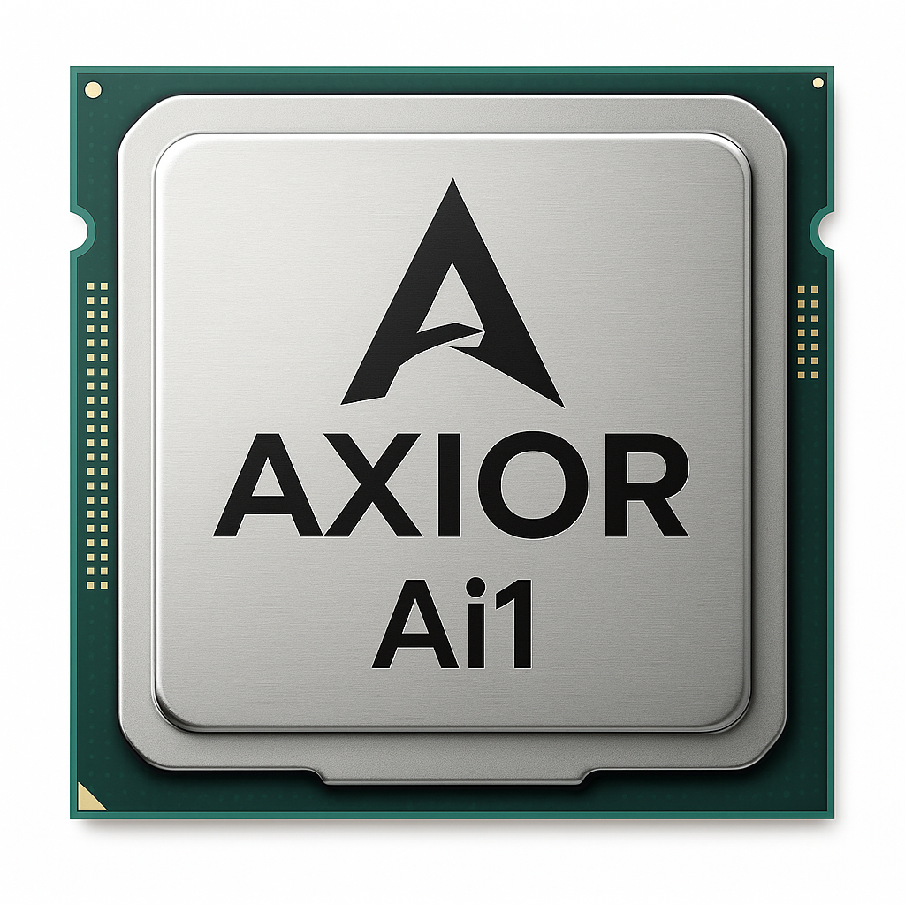

# Axior: The DeepSeek Moment for AI Hardware

Axior is a chipmaker on a mission to shatter the monopoly of San Francisco AI hardware giants. We are creating a “DeepSeek moment” for the hardware layer. We achieve this by delivering open, modular, and accessible AI chips and modules that empower developers, researchers, and businesses to build, scale, and own their AI infrastructure, without vendor lock-in.

Just as DeepSeek and Llama have democratized access to powerful AI models, Axior is democratizing the silicon that runs them. Our platform is designed for the new wave of local and edge AI, where privacy, cost, and flexibility matter most.

> **Why Inference?**
> AI innovation is bottlenecked by closed, cloud-centric hardware. Local inference enables privacy, low-latency, and cost-effective deployment. This empowers everyone from researchers to startups to run state-of-the-art models on-premises.

### Why Now? The Rise of Local AI Clusters

- **Mac Mini clusters** are being used to run models like Nemotron 70B and Llama 405B at home and in labs ([heise.de](https://www.heise.de/en/news/Local-AI-Nemotron-70B-on-four-Mac-minis-M4-Pro-with-Thunderbolt-5-interconnect-10015283.html), [Geeky Gadgets](https://www.geeky-gadgets.com/exploring-the-potential-of-m4-mac-mini-clusters-for-machine-learning/)).
- Unified memory and efficient SoCs (like Apple M4) have enabled new distributed AI setups, but these solutions are expensive, closed, and not modular.
- The **edge AI hardware market** is projected to grow from $24.2B (2024) to $54.7B (2029) at a 17.7% CAGR ([MarketsandMarkets](https://www.marketsandmarkets.com/Market-Reports/edge-ai-hardware-market-158498281.html)), driven by demand for private, low-latency AI deployments in everything from smart homes to industrial automation.

---

# Axior Ai1 Platform

## Mission
Axior is building the “Raspberry Pi of AI”—open, modular, and accessible AI hardware for the next wave of application-layer AI. Our platform is designed for:
- **DIY AI enthusiasts** building local clusters
- **Consumer devices** (smart devices, robots, kiosks) with on-board AI
- **AI Application Developers and SMBs** needing scalable, open, and affordable inference

## Why Yet Another AI Chip?
Despite advances in smartphone and server AI accelerators, there is **no open, modular SoM** optimized for edge inference. Apple, NVIDIA, and Google offer powerful solutions, but they are:
- Closed ecosystems (no open hardware or toolchains)
- Limited in modular memory (soldered RAM, no SODIMM)
- Expensive and not cluster-friendly

Axior Ai1 is the first SoC/SoM to combine:
- **Jetson NX pin compatibility** for drop-in upgrades
- **Unified DDR5 memory** (up to 512GB with 4 slots, future-proofed to 1TB+)
- **Open toolchain** (ONNX, vLLM, TFLite, TVM, MLIR, PyTorch)
- **Modular clustering**—carriers can host 1–4 SoMs, interconnected via PCIe or 10GbE

## Market Segment & Vision
- **Phase 1:** Maker communities, researchers, and local AI clusters
- **Phase 2:** Consumer-grade devices and commercial appliances
- **Phase 3:** Direct SoC sales—becoming the “RK3588 of AI inference” powering the next generation of open AI platforms

> Just as the RK3588 SoC powers most Chinese IoT devices andSBCs that previously relied on Raspberry Pi, Axior Ai1 is designed to be the foundation for the next wave of open AI solutions—enabling everything from hobbyist clusters to commercial appliances.

---

# Axior Ai1 SoM: Jetson-Compatible, Massively Modular

| Feature         | Specification                                      |
|-----------------|----------------------------------------------------|
| **Form Factor** | Extended Jetson NX (70 × 45 mm, 4 SODIMM slots)    |
| **Connector**   | 260-pin SO-DIMM (Jetson-compatible)                |
| **Memory**      | 4× DDR5 SODIMM (vertical, 1 per channel)           |
| **Max RAM**     | 128GB/slot today (512GB total); future 1TB+        |
| **I/O**         | PCIe Gen4×4, USB 3.2×2, HDMI/DP++, 2× MIPI-CSI, GbE/10GbE, SDIO, GPIO/I²C/SPI/UART |
| **Clustering**  | Carrier boards: 1–4 SoMs, PCIe/10GbE mesh          |
| **Power**       | 5–12V input, on-module PMIC                        |
| **Thermal**     | Copper slug, vapor spreader, optional blower       |

- **Jetson carrier compatibility**: Full pinout, drop-in for Jetson NX ecosystem
- **Unified memory**: CPU, GPU, NPU share DDR5 for large LLMs, vision, and audio
- **Modular RAM**: SODIMM unlocks affordable upgrades and future capacity

---

# Axior Ai1 SoC: Open, Scalable, Future-Proof

| Subsystem        | IP Core / Vendor                        | Features / Differentiators                       |
|------------------|-----------------------------------------|-------------------------------------------------|
| **CPU**          | 8× Cortex-A78AE (Arm)                   | ECC, ASIL-D, high-perf Linux, 2.2GHz             |
| **GPU**          | PowerVR BXE-BX4-64 (Imagination)        | Vulkan 1.3, OpenCL 3.1, 64 clusters              |
| **NPU**          | 4× Flex Logix InferX X1 tiles           | 40+ TOPS INT8, modular, ONNX/vLLM/TVM support    |
| **DSP**          | Cadence HiFi 5                          | Voice/audio acceleration                        |
| **Memory Ctrl**  | Synopsys DDR5 4-ch + PHY                | 4× SODIMM, up to 512GB, ECC, future 1TB+         |
| **PCIe**         | Gen4 ×4 (bifurcation: NVMe, Wi-Fi, mesh)| Scalable clustering, NVMe/10GbE/expansion        |
| **NoC**          | FlexNoC 5 (Arteris)                     | 512-bit coherent interconnect                    |
| **Security**     | Arm TrustZone, CryptoCell-312, TPM      | Secure boot, eFuse OTP, Infineon SLB9670 TPM     |
| **PMIC**         | Dialog DA9063-L or Renesas RAA215300    | Multi-rail, DDR5 VPP, sequencing                 |
| **Process**      | TSMC N7/N6 (130–140 mm² die)            | Low power: ~3W idle, 18–25W peak                 |

- **Estimated SoC cost**: $30–40 @100K units
- **Full SoM (8GB RAM) target**: $129–149 retail
- **Scales to $199–249 with 32–64GB modules**

---

# Architectural Decisions & Differentiators

- **4× DDR5 SODIMM slots**: Each channel supports a full-speed UDIMM; future quad-rank or RDIMM could enable 1TB+.
- **Unified memory**: Enables large LLMs, multimodal models, and efficient clustering—outclassing fixed-RAM solutions (Apple, NVIDIA, Coral, Hailo, etc).
- **Jetson NX compatibility**: Enables drop-in upgrades and leverages a vast ecosystem of carrier boards and accessories.
- **Open toolchain**: Supports ONNX, vLLM, TFLite, TVM, MLIR, PyTorch out of the box.
- **Clustering**: Carrier boards can be designed for single or multi-SoM (1, 2, or 4 modules), interconnected via PCIe switch or 10GbE. Management handled by on-board CPUs.

---

# Clustering & Carrier Board Ecosystem

- **Single SoM**: Compact, affordable, and ideal for desktop or embedded use
- **Dual/Quad SoM**: Carrier boards for scale-out, micro-rack, or edge inference clusters
- **Interconnect**: PCIe mesh or 10GbE fabric; low-latency, high-throughput for LLM serving
- **Future-proof**: As model sizes and RAM needs grow, the modular DDR5 design enables affordable upgrades—no soldered limits

---

# Market & Vision: Why Axior, Why Now?

- **Mac Mini clusters** are already being used for local AI inference ([heise.de](https://www.heise.de/en/news/Local-AI-Nemotron-70B-on-four-Mac-minis-M4-Pro-with-Thunderbolt-5-interconnect-10015283.html), [Geeky Gadgets](https://www.geeky-gadgets.com/exploring-the-potential-of-m4-mac-mini-clusters-for-machine-learning/)), but they are closed, expensive, and not modular.
- The **edge AI hardware market** is projected to more than double by 2029 ([MarketsandMarkets](https://www.marketsandmarkets.com/Market-Reports/edge-ai-hardware-market-158498281.html)), with demand for local, private, and scalable inference solutions.
- **No direct competitor** offers open, modular, Jetson-compatible SoMs with unified DDR5 memory and clustering support.
- Axior is positioned to be the “Raspberry Pi of AI”—the foundation for the next generation of open, accessible, and scalable AI hardware.

---

# Resources & Further Reading
- [Local AI: Nemotron 70B on four Mac minis M4 Pro with Thunderbolt 5 interconnect (heise.de)](https://www.heise.de/en/news/Local-AI-Nemotron-70B-on-four-Mac-minis-M4-Pro-with-Thunderbolt-5-interconnect-10015283.html)
- [Exploring the Potential of M4 Mac Mini Clusters for Machine Learning (Geeky Gadgets)](https://www.geeky-gadgets.com/exploring-the-potential-of-m4-mac-mini-clusters-for-machine-learning/)
- [Edge AI Hardware Market Size, Share and Growth Analysis (MarketsandMarkets)](https://www.marketsandmarkets.com/Market-Reports/edge-ai-hardware-market-158498281.html)

---

*Axior Ai1* empowers a new era of **open, scalable, on-device AI**—undercutting closed ecosystems and making local inference accessible to all.

> For more, contact: Keyvan M. Sadeghi, Founder, TransposeReal | keyvan@treal.world
